<!-- _class: title -->
<!-- _paginate: false -->

# CIFAR-10 Classification from Scratch

## CSI 4140/5140, Project 1

 

**Anton Sakhanovych & Gavin D'Hondt**, Group 5
March 2026

---

# Problem & Constraints

Classify 32x32 RGB images from CIFAR-10 into 10 categories (50k train, 10k test).

All components implemented from scratch. No `nn.Module`, no `torch.optim`.

| Category | Components |
|---|---|
| Layers | Conv2D (im2col), Fully Connected, ReLU, Sigmoid, Softmax, Flatten, Dropout |
| Optimizers | SGD, SGD + Momentum (EMA), Adam |
| LR Schedules | Cosine decay, Step decay |
| Regularization | L2 weight penalty, Inverted dropout |
| Data | Per-channel normalization, random flip, random crop |

---

# Model Architecture

Three conv blocks with **strided convolutions** for downsampling, then two FC layers.

| Layer | Output |
|---|---|
| Conv(3 &rarr; C₁, s=1) + ReLU | (N, C₁, 32, 32) |
| Conv(C₁ &rarr; C₂, **s=2**) + ReLU | (N, C₂, 16, 16) |
| Conv(C₂ &rarr; C₃, **s=2**) + ReLU | (N, C₃, 8, 8) |
| Flatten | (C₃ &middot; 64, N) |
| FC &rarr; ReLU | (512, N) |
| FC &rarr; Softmax | (10, N) |

### Key details
- Convolutions use `F.unfold` (im2col): patches become columns, forward pass is a single matmul
- He initialization: $w \sim \mathcal{N}(0,\; 2/n_\text{in})$
- Strided convolutions let the network learn its own downsampling

### Baseline width
C₁=32, C₂=64, C₃=128

---

# Ablation Study

8 experiments, each varying **one factor** while holding the rest at baseline.

**Baseline:** Adam (lr=0.001, default betas), standard width, ReLU, augmentation on, no regularization. 15 epochs per experiment.

| Experiment | What was varied | Baseline result |
|---|---|---|
| Optimizer & LR | Adam vs SGD+Momentum | 78.15% |
| Adam betas | β₁ and β₂ | 76.61% |
| LR schedule | Cosine vs Step vs None | 77.53% |
| Data augmentation | On vs Off | 78.06% |
| Network width | Slim / Standard / Wide | 77.18% |
| Activation | ReLU vs Sigmoid | 77.78% |
| Regularization | None / L2 / Dropout / Both | 77.78% |
| L2 lambda | 10⁻⁴ through 10⁻¹ | 77.35% |

---

# Data Augmentation

The single largest factor in the ablation study: **+13 points** from random flip + crop (pad 4).

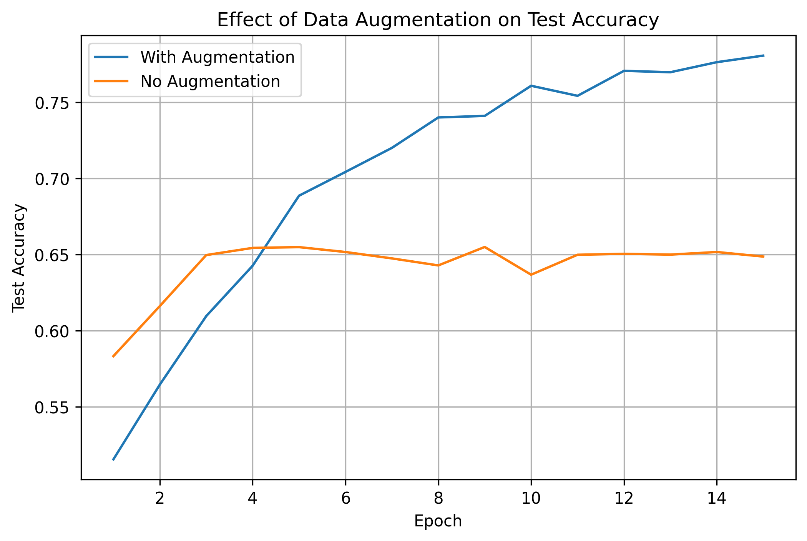

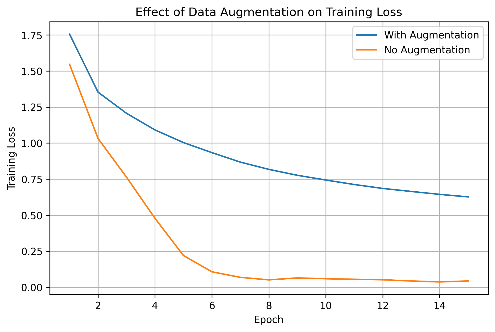

---

# Data Augmentation (cont.)

|  | Test Acc | Train Acc | Train Loss |
|---|---|---|---|
| **Augmentation on** | **78.06%** | 78.21% | 0.6269 |
| Augmentation off | 64.86% | 98.62% | 0.0436 |

Without augmentation, training accuracy reaches 98.6% while test accuracy stalls at 64.9%. The model memorizes pixel patterns rather than learning generalizable features. Training loss collapses to near zero while test loss climbs past 2.0.

With augmentation on, training and test accuracy stay within a few points of each other throughout all 15 epochs.

---

# Optimizer: Adam vs SGD+Momentum

Adam (lr=0.001) outperforms SGD+Momentum at every learning rate tested.

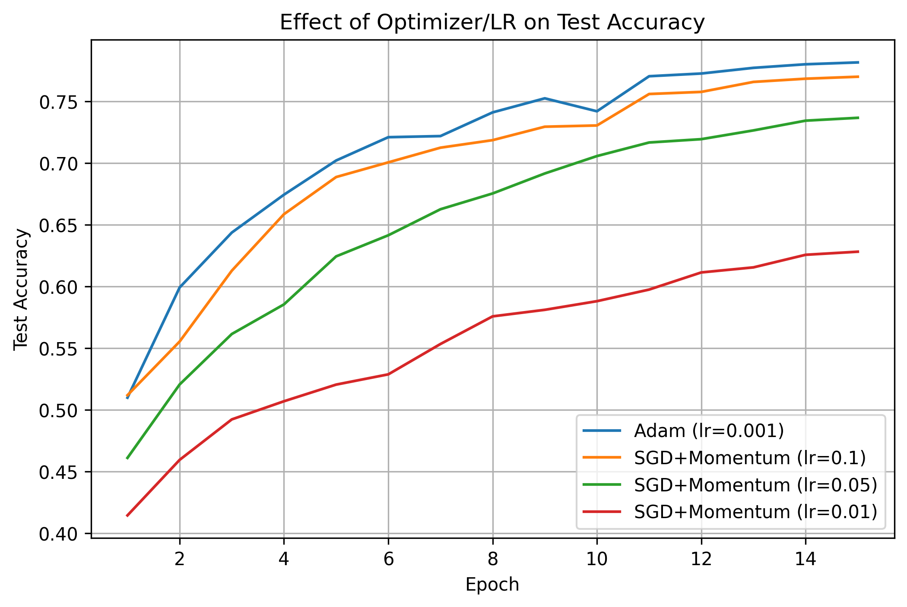

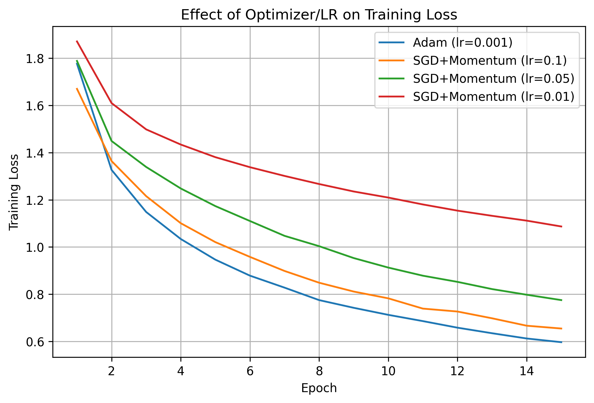

---

# Optimizer (cont.)

| Optimizer | LR | Test Acc | Train Loss |
|---|---|---|---|
| **Adam** | **0.001** | **78.15%** | **0.5969** |
| SGD+Momentum | 0.1 | 76.99% | 0.6548 |
| SGD+Momentum | 0.05 | 73.66% | 0.7752 |
| SGD+Momentum | 0.01 | 62.81% | 1.0870 |

Adam's per-parameter adaptive learning rates mean a single lr=0.001 works well. Momentum is very sensitive to the global learning rate: competitive at 0.1, but barely converges at 0.01.

---

# Activation: ReLU vs Sigmoid

Sigmoid falls over **10 points** behind ReLU due to vanishing gradients.

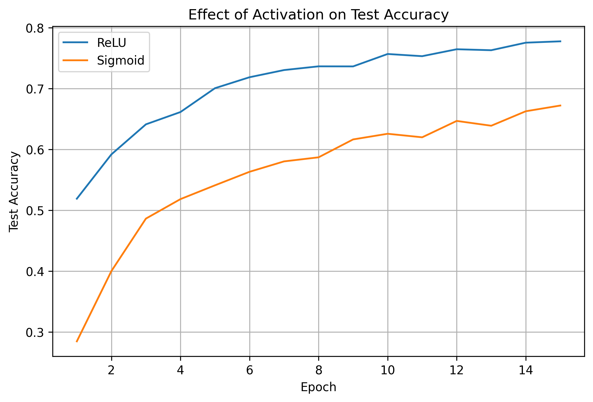

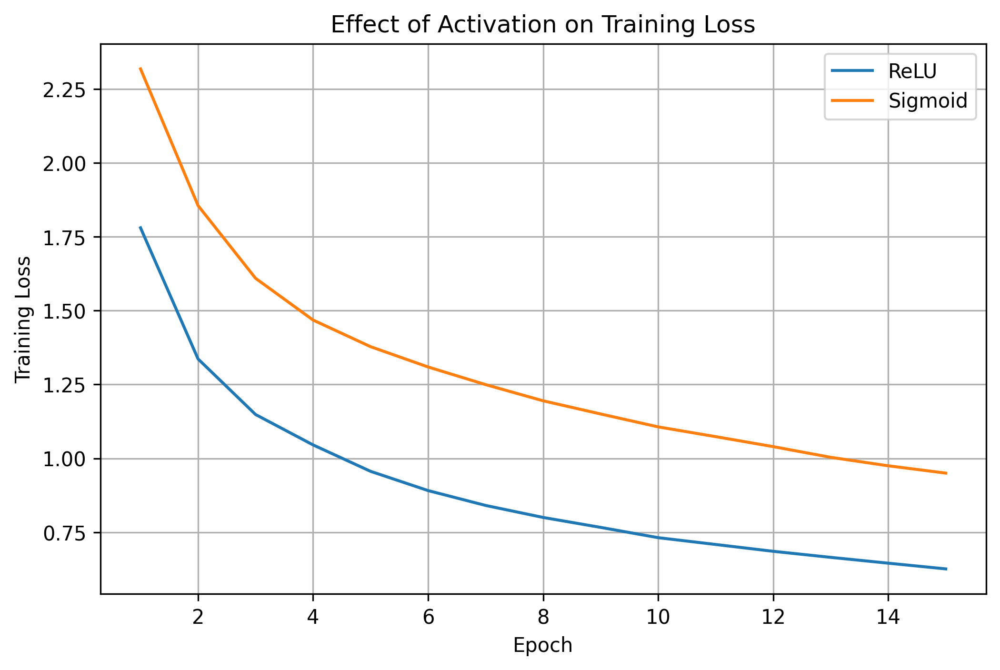

---

# Activation (cont.)

| Activation | Test Acc | Train Loss |
|---|---|---|
| **ReLU** | **77.78%** | 0.6260 |
| Sigmoid | 67.23% | 0.9501 |

Sigmoid saturates at both extremes of its output range, driving the derivative toward zero. Across multiple layers, the gradient product shrinks exponentially, starving early layers of any training signal.

He initialization (which we use) is also designed specifically for ReLU. It accounts for the fact that ReLU zeroes out roughly half the neurons and scales the initial weights to compensate. That assumption does not hold for Sigmoid.

---

# L2 Regularization Strength

The usable range for L2 is narrow. One order of magnitude separates "no effect" from "training failure."

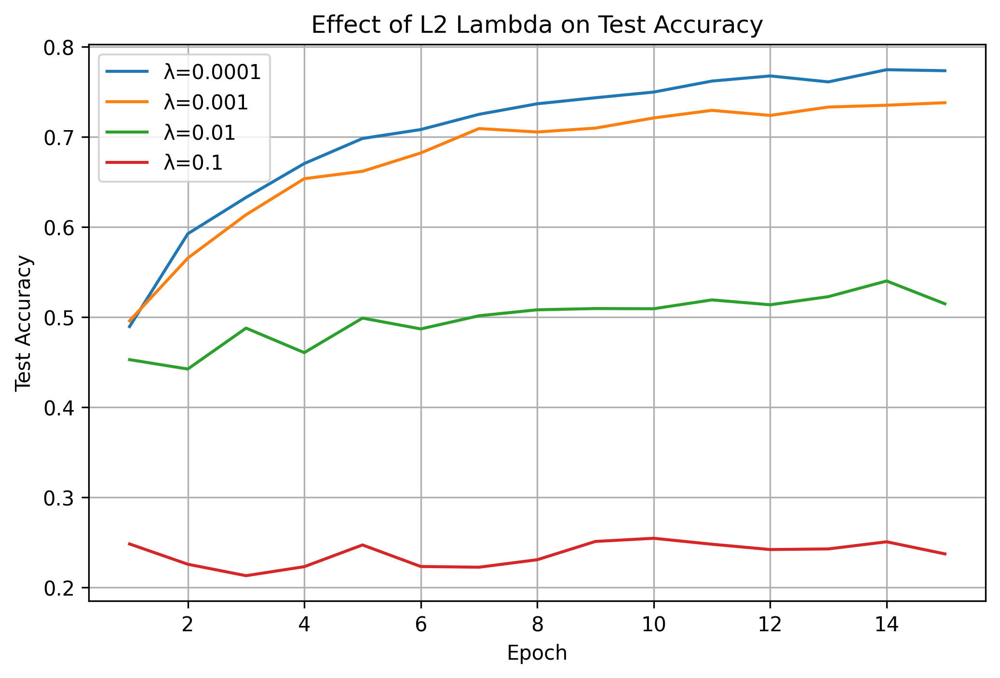

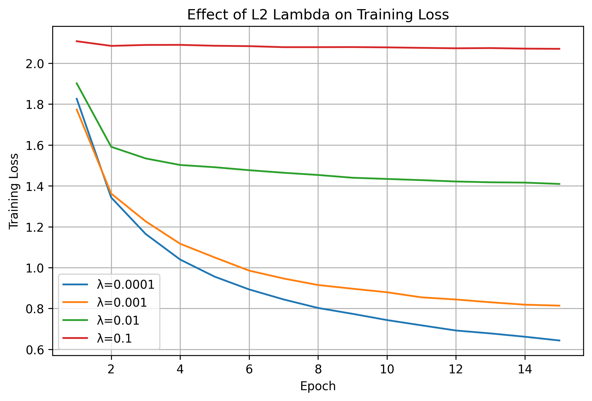

---

# L2 Strength (cont.)

| λ | Test Acc | Observation |
|---|---|---|
| 10⁻⁴ | 77.35% | Near baseline |
| 10⁻³ | 73.80% | Mild slowdown |
| 10⁻² | 51.49% | Penalty dominates updates |
| 10⁻¹ | 23.74% | Near random chance |

Below 10⁻⁴, the penalty gradient is too small to compete with the data gradient. At 10⁻², the penalty has taken over the update step entirely, so weight updates are dominated by shrinkage rather than the loss signal.

---

# Regularization Method

No regularization wins at 15 epochs because the model has not started overfitting yet.

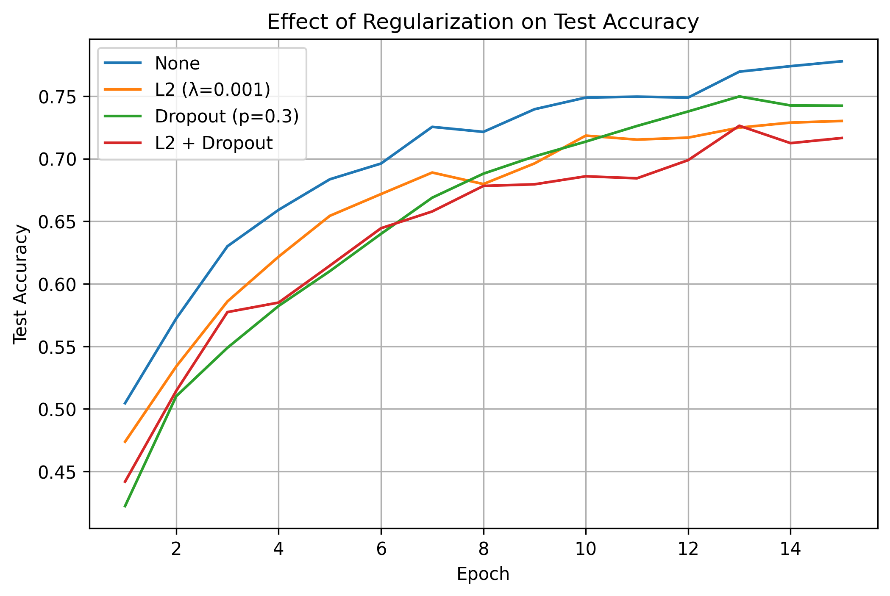

| Method | Test Acc | Train Acc |
|---|---|---|
| **None** | **77.78%** | 77.88% |
| Dropout (p=0.3) | 74.23% | 70.70% |
| L2 (λ=0.001) | 73.01% | 70.79% |
| L2 + Dropout | 71.65% | 66.36% |

Training and test accuracy are within 1 point of each other. There is no overfitting to prevent, so regularization only slows convergence.

---

# Colab Training Challenges

Several issues had to be resolved to train on Google Colab's free GPU tier.

| Problem | Cause | Fix |
|---|---|---|
| ~14 GB memory from autograd | `nn.Parameter` defaults to `requires_grad=True`, so PyTorch builds a computation graph even though we compute gradients manually | Wrapped forward/backward in `torch.no_grad()` |
| OOM in Adam/Momentum | Each optimizer step allocated ~6 intermediate tensors per parameter | Switched to in-place ops (`mul_`, `add_`, `addcmul_`) |
| OOM from cached activations | Forward pass caches (unfolded input, ReLU mask) persisted through the full backward pass | Freed caches immediately after each layer's backward |
| Device mismatch errors | Parameters created on CPU, training data moved to GPU | Added lazy `.to(device)` for params and optimizer state |
| NaN loss | `log(0)` when softmax output is near zero | Clamped probabilities to a minimum of 1e-12 |

---

# Final Configuration

Best setting from each ablation experiment, trained for 50 epochs.

| Component | Choice |
|---|---|
| Optimizer | Adam, lr=0.001 |
| Betas | β₁=**0.8**, β₂=**0.99** |
| Width | **Wide** (64, 128, 256) |
| LR Schedule | Step decay, γ=0.5 / 5 ep |
| Augmentation | Flip + crop (pad 4) |
| Regularization | None |
| Epochs | 50 |

### Changes from baseline
- β₁ lowered from 0.9 to 0.8 (+1 pt)
- β₂ lowered from 0.999 to 0.99
- Filters doubled at each stage (+1.7 pt)
- Step decay for late-stage refinement
- Training extended from 15 to 50 epochs

---

# Final Results

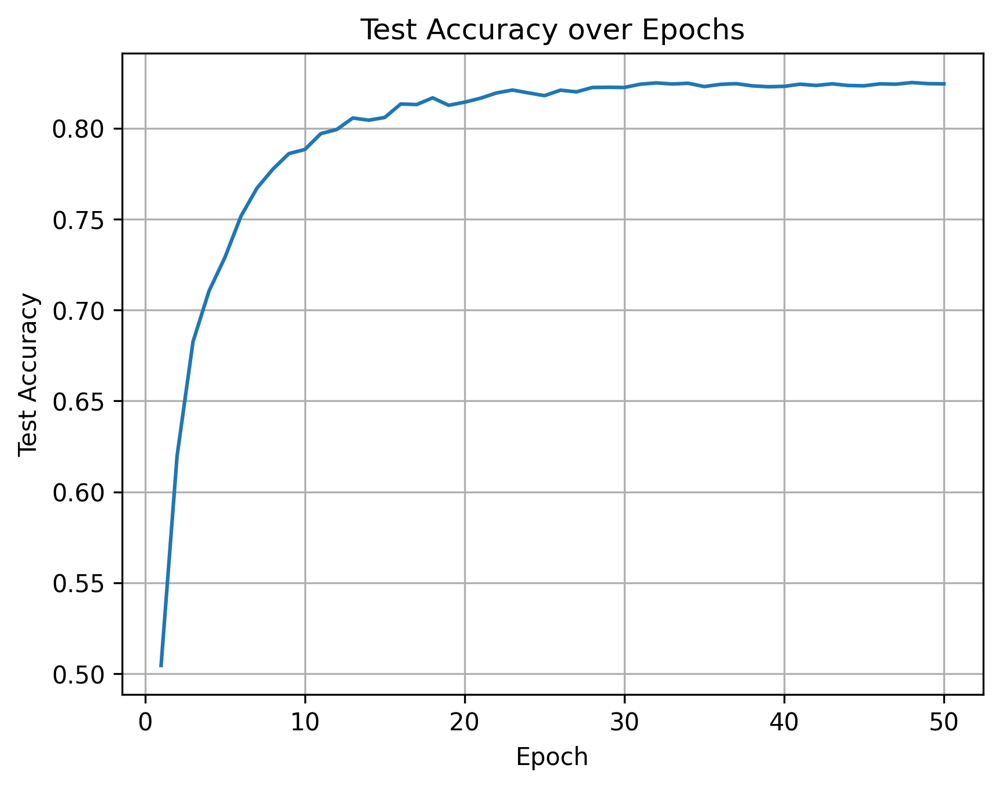

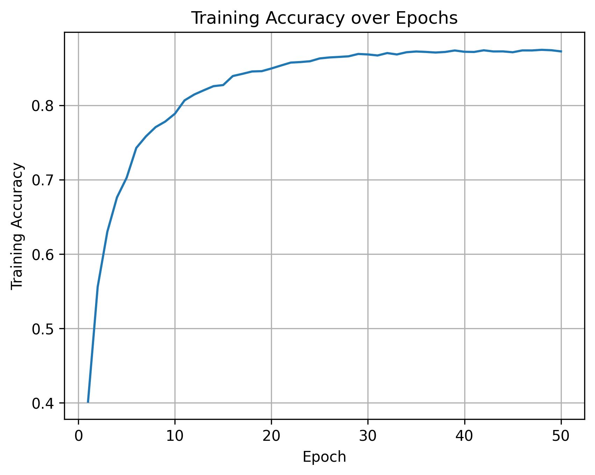

---

# Final Results (cont.)

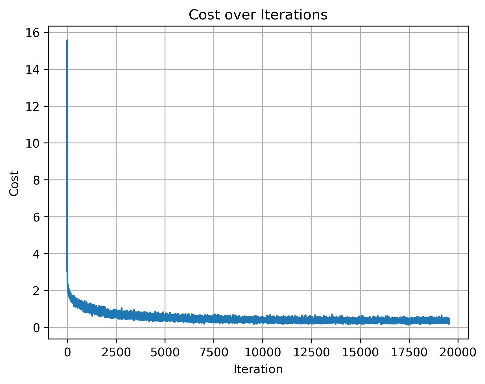

- Crosses **80%** at epoch 13
- Peaks at **82.51%** at epoch 48
- After epoch 30, accuracy settles in a narrow band above 82%
- Clears the 75% requirement and the 80% extra credit threshold
- **+4.36 points** over the ablation baseline of 78.15%

---

<!-- _class: title -->
<!-- _paginate: false -->

82.51%

## Final Test Accuracy

Wider filters · Tuned Adam betas · Step decay · 50 epochs

 

Anton Sakhanovych & Gavin D'Hondt, Group 5
